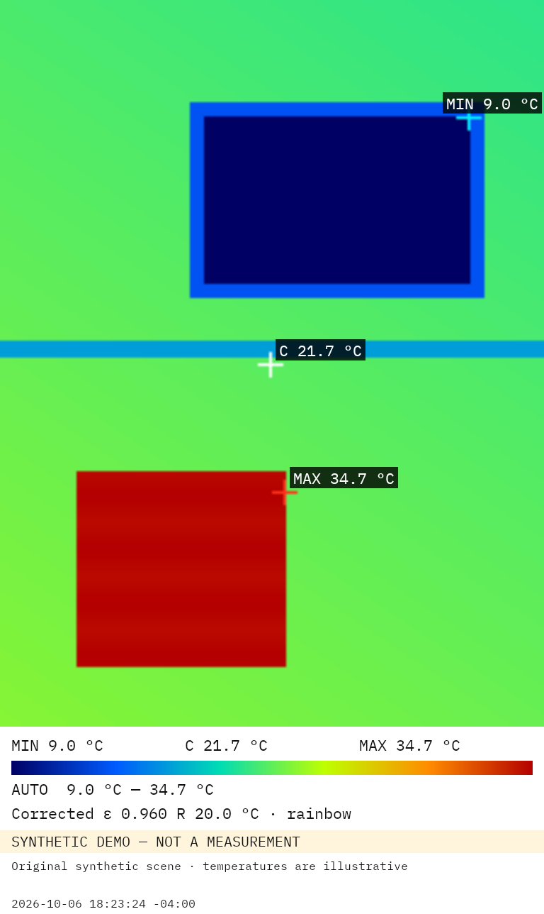

# Thermal Field

An independent, open-source Android thermal viewer for the USB device `0bda:5830` used by the InfiRay P2 Pro. Built for building-enclosure thermography, with a Gridline interface, native capture and lossless radiometric export. This project is not affiliated with the camera manufacturer.

**Development preview.** Live USB, experimental network capture and host radiometric correction have run on a Pixel 9 Pro. Measurement tools are implemented and undergoing device qualification. Comparison against the official app on ice-water and approximately 55 °C water targets has **not** been completed; camera-apparent and model-corrected values are not independently validated surface temperatures.

[Download the arm64 Android APK](https://github.com/thereprocase/thermal-cam-droid/releases/download/v0.1.3-rc1/ThermalField-0.1.3-rc1-arm64-v8a.apk) · [Release notes and source archive](https://github.com/thereprocase/thermal-cam-droid/releases/tag/v0.1.3-rc1) · [Project page and screenshots](https://thereprocase.github.io/projects/thermal-field/)

## Current features

**0.1.3-rc1** is an experimental release candidate with the features below, including the larger viewer and sensor-driven full-screen rotation. Software checks have passed on the Pixel and an Android 16 AVD; short direct-USB gain/NUC/readback checks also passed. Sustained maximum-workload USB, physical detach/reattach and mounting/orientation, official-app parameter persistence/baseline and bath qualification remain open. This is not a measurement-accuracy certification. Earlier releases retain their original assets.

- Native USB capture through Android UsbManager, a borrowed file descriptor, libusb and libuvc. No proprietary camera SDK.
- GPU rendering of the bottom 256 × 192 radiometric plane; the camera's AGC preview is ignored for display.
- Ironbow, white-hot and rainbow; center/min/max markers; °C/°F; automatic or manually locked span with deliberate clipping.
- Rotate in 90° steps, mirror, 180° flip and a separate screen-rotation lock.
- Up to 16 sensor-coordinate spots, inclusive boxes with min/max/mean, and lines with nearest-pixel profiles. Edit or delete geometry; compare two spots as ordered ΔT A − B. Invalid correction samples are excluded from statistics.
- Inclusive isotherm bands and below/above threshold modes, using the current apparent/corrected model. Cyan highlighting and matched-pixel counts are recorded with the capture.
- An image-first workspace with grouped controls panels, an overlaid color scale and temperature summary, and rotation buttons in usable letterbox space. Layout qualification is ongoing.
- Immersive full-screen view with four-way sensor-driven GUI rotation, capture/exit overlays, source/model context and volume-key capture. Back exits full-screen mode. USB rendering and exports compensate a phone-mounted camera’s orientation.
- Manual NUC in the Camera panel and full screen, with session-specific pending/completed/failed command history. Recent-command banners distinguish paused delivery from repeated samples; they do not identify shutter motion or certify calibration.
- Capture an annotated PNG, original 16-bit grayscale radiometric PNG and JSON sidecar through MediaStore, under `Downloads/ThermalField`.
- Volume Down captures the annotated view; Volume Up or X selects raw as the preferred share item. Every capture still saves all three files. Share one image, the raw plane or the complete set through Android's chooser.
- Browse complete captures accessible to this installation and reopen their original 16-bit planes for reanalysis. Saved-frame edits use a separate profile; returning to a live source restores the survey's applied correction, display settings and sensor-coordinate measurements. Derived exports preserve acquisition time and record a separate export time. Saved synthetic frames remain explicitly labeled.
- Manual NUC and gain controls; frame-age and performance diagnostics; debug composite-frame dumps.
- Global emissivity/reflected apparent temperature inputs and raw/corrected display using an integrated 8–14 µm Planck model. Extrema, center, GPU coloring and capture metadata share the same per-frame lookup table. Invalid solutions are magenta and excluded from extrema.
- Original synthetic demo for UI development, explicitly labeled as synthetic.
- Experimental lossless network source from the included desktop bridge. This decoder requires original composites with thermal-field-v1 headers; other IP thermal camera formats need an adapter.

Planned: importing captures from other installations, annotation naming and further lifecycle/accuracy qualification. See [saved-capture behavior](docs/SAVED_CAPTURES.md), [feature scope](docs/FEATURES.md) and [validation](docs/VALIDATION.md).



Original synthetic enclosure example, corrected at ε = 0.96 and reflected input 20 °C. The illustrated temperatures are test data, not a physical camera measurement. Source, correction inputs, legend and timestamp are measurement context rather than a branding watermark.

## Build and install

Requirements: JDK 21, Android SDK platform 37, NDK `28.2.13676358`, CMake `3.22.1`. The APK supports **arm64-v8a only**, Android 16/API 36 or newer, and targets API 37. Install the SDK components with Android Studio or `sdkmanager`, then set `sdk.dir` in an ignored `local.properties` file.

```sh
./gradlew :app:assembleDebug :app:testDebugUnitTest
adb install -r app/build/outputs/apk/debug/app-debug.apk
```

The bundled Gradle wrapper downloads its pinned distribution. Grant Camera and USB permissions for direct USB capture. Android 17 also requests local-network access for the network source. Keep capture in the foreground; backgrounding pauses the source. The app responds to USB attach for the supported vendor/product ID.

Host regression tests need a C++17 compiler and CMake:

```sh
cmake -S . -B build/native
cmake --build build/native
ctest --test-dir build/native --output-on-failure
```

The framework-only Android integration runner exercises native saved-frame rendering, firmware/register provenance, lossless export, MediaStore reopening and queued-control cancellation between synthetic loopback sources on a connected device:

```sh
./gradlew :app:assembleDebug :app:assembleDebugAndroidTest
adb install -r app/build/outputs/apk/debug/app-debug.apk
adb install -r app/build/outputs/apk/androidTest/debug/app-debug-androidTest.apk
adb shell am instrument -w com.thereprocase.thermalfield.test/com.thereprocase.thermalfield.ValidationInstrumentation
```

It creates and removes its own synthetic capture sets. It also holds the gallery worker to verify capture can complete independently, then holds the capture worker to verify a request is cancelled if its source session changes before snapshot acceptance. Its synthetic firmware/register inputs do not qualify physical camera accuracy.

For UI work without an unlocked phone, use an Android 16/API 36 or newer x86_64 AVD. The isolated emulator build uses package `com.thereprocase.thermalfield.emulator`; it shares the native renderer/decoder, but does not change the arm64 device/release configuration. Release variants are disabled when this option is selected.

```sh
./gradlew -PemulatorValidation=true :app:assembleDebug :app:assembleDebugAndroidTest
adb -s emulator-5556 install -r app/build/outputs/apk/debug/app-debug.apk
adb -s emulator-5556 install -r app/build/outputs/apk/androidTest/debug/app-debug-androidTest.apk
adb -s emulator-5556 shell am instrument -w com.thereprocase.thermalfield.emulator.test/com.thereprocase.thermalfield.ValidationInstrumentation
python3 tools/check_emulator_ui.py --serial emulator-5556
```

Wait for the AVD to finish booting before installing. Adjust the emulator serial to match `adb devices`. The UI checker uses only the isolated emulator package and synthetic data. It checks full-screen controls, rotation/mirroring, reflected-temperature sign entry and the source label after Home/return. These checks do not establish USB behavior, thermal accuracy or Pixel performance. Rebuild without `-PemulatorValidation=true` before installing on the Pixel; the build output path is shared between configurations.

Add `-e workload true` to the instrumentation command for an optional one-minute synthetic GPU/measurement workload: 16 geometries, band correction, isotherm and a capture during the stream. It uses a 768×576 ImageReader surface, rather than the visible display, and reports its scoped counters/timings. Native debug code is optimized with symbols and assertions retained to exercise the 40 ms frame budget in development builds.

For foreground recovery checks, first connect the unlocked debug app to a healthy desktop bridge, then run:

```sh
python3 tools/check_pixel_network_lifecycle.py --serial YOUR_ADB_DEVICE --cycles 10 --output lifecycle-results.json
```

The checker cycles Home/return, requires fresh telemetry after each return and samples the app process's open descriptors. It reports observed counts and source gaps; it does not qualify physical USB detach/reattach or sensor accuracy.

Native decoding is tested against a captured composite fixture. Radiometric PNG tests independently decode all 49,152 words and verify exact preservation. Synthetic radiometry tests verify numerical behavior, not camera accuracy.

The remaining powered-device persistence, official-app water-bath and direct-USB lifecycle checks have a [physical bench procedure](docs/PHYSICAL_BENCH.md). Observed results and their limits remain in [VALIDATION.md](docs/VALIDATION.md).

Measurement geometry is stored in original sensor pixels. Boxes include both endpoint pixels; line samples are evenly spaced and rounded to the nearest sensor pixel, with both endpoints included. Box/line means average valid temperatures after correction, rather than applying correction to an averaged word or radiance. Profiles show sample positions, without a physical-length calibration. Δ°F scales Δ°C by 1.8 with no absolute-temperature offset. JSON retains full geometry, validity counts, profile values/indices and the selected isotherm/ΔT configuration from the captured frame. The live layout, ordered delta selection, isotherm settings and next measurement ID are stored after accepted edits and restored on startup. Saved-frame edits remain local to reanalysis. Corrupt or unsupported stored layouts produce an explanatory message and leave the live engine with its default empty layout.

## Radiometric meaning

The normal workspace gives the remaining screen area to the image. Controls are grouped into View, Measure, Correction, Camera and Info panels. The color scale and temperature summary overlay the image; rotation controls use existing letterbox space when 48 dp touch targets fit.

Full screen requests Android's four-way sensor orientation, including upside-down portrait. Screen rotation lock freezes the GUI orientation. For a USB camera rigidly mounted to the phone, the rendered image subtracts the current display quarter-turn from the manual camera offset, with flip and mirror retained. An extension-mounted camera may move independently: use rotation lock and the manual controls to set its mounting offset. Network and saved sources keep their independent/original image orientation. Rendered captures bake in the applied rotation and report it in JSON; raw exports stay in sensor coordinates. Android's orientation policy handles sensor filtering rather than a second app-level accelerometer threshold implementation. See [Android display rotation](https://developer.android.com/reference/android/view/Display#getRotation()) and [fullSensor orientation](https://developer.android.com/guide/topics/manifest/activity-element#screen).

The received stream is 256 × 384 YUYV. The lower half contains unsigned little-endian words with the documented conversion `T_C = word / 64 - 273.15`. Raw exports preserve those words in sensor orientation, independently of display rotation, mirroring, palette and span. PNG stores 16-bit samples in PNG's big-endian order; pixel values remain unchanged.

The camera has readable/writable correction properties. Startup requests distance 32, reflected/atmospheric temperature 300 K, emissivity/transmission 128, and the saved USB gain selection (high by default). Every requested property must match its readback before startup is accepted. A successful USB gain change is persisted for foreground/reconnect recovery. Capture waits for a post-command frame with the confirmed gain. Register readback is checked, but the physical interpretation of this baseline has **not** been independently qualified. A maximum register value alone does not prove emissivity or transmission is physically one. JSON states this qualification explicitly. Network gain is currently exported as unknown until per-frame bridge state is integrated.

The correction core integrates Planck radiance over 8–14 µm, assumes a flat spectral response and atmospheric transmission of one at short range, solves the single-band graybody equation and inverts a lookup table. It does not use a temperature-to-the-fourth approximation. Raw/corrected mode selects the display and numeric-readout model; the raw file always preserves the original camera words. The JSON records the actual selected mode and inputs. The default reflected temperature of 20 °C is an input default, not a measured environment value. Nonpositive solved radiance and temperatures outside the table domain are invalid, displayed as magenta, excluded from extrema and exported as JSON null readings where applicable.

For numerical/export verification of a synthetic demo capture, install Pillow on the development host and run:

```sh
python3 tools/verify_capture.py fixtures/synthetic-enclosure.yuyv CAPTURE_raw.png CAPTURE.json
```

This compares every original word and evaluates min/max/center using finer direct Planck quadrature and bisection, independently of the app's interpolation table. Passing it does not establish physical camera accuracy.

## Experimental desktop bridge

With the supported camera connected to a Linux host, install FFmpeg and Python 3 plus the host libusb runtime. The included bridge validates the device identity and forwards complete original composites. It can issue bounded NUC/gain commands when USB device permissions allow.

```sh
python3 tools/desktop_bridge.py --device /dev/video0 --bind 127.0.0.1 --port 8010
```

For a phone, bind explicitly to a trusted LAN or Tailscale interface and enter `http://HOST:8010/radiometric` in the app's Network source dialog. The prototype has **no application authentication**; access control must come from the trusted interface/firewall/Tailnet policy. Do not expose it to the public internet. The stream is approximately 4.9 MB/s before network overhead. Frame sequence gaps and receiver-to-display latency are reported; the latter excludes network transit and sensor exposure.

## Privacy and licensing

No account, analytics or cloud service is required. There is no location permission. Exports omit persistent camera identifiers and the network URL. Network addresses remain local app preferences. A user's scene and timestamp can still be identifying: review your own images before sharing or publishing them. Public examples use original synthetic data.

Project code is MIT; dependencies retain their own licenses. libusb is a separately built LGPL-2.1-or-later shared library, with corresponding source and Android build rules included under `third_party/libusb`. See [NOTICE](NOTICE.md) before reusing or redistributing. No vendor product images, logos, proprietary camera libraries or GPL application code are included. Camera names identify compatibility only.

Published APKs use a project-specific release signer. Development builds use a different signer; Android cannot update an installation signed with another key. Preserve your captures before changing installation types. See [release/build instructions](docs/RELEASE.md) and the in-app Licenses and notices pane. A CI template is included; activation is pending GitHub workflow authorization. Versioned GitHub Releases contain the signed installer.

Protocol bytes and pinned source-file/line provenance: [PROTOCOL.md](docs/PROTOCOL.md). Original-scope completion and remaining acceptance gates: [ACCEPTANCE.md](docs/ACCEPTANCE.md).
